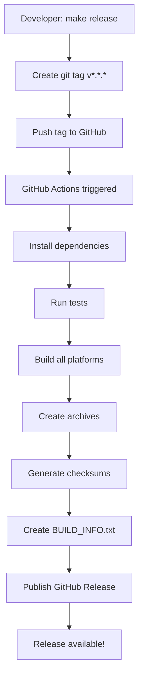

# Build System Documentation

This document explains the build system for Backthynk, including local development builds and CI/CD workflows.

## Overview

The build system has been designed to support two distinct workflows:

1. **Local Development**: Build only for your current platform for quick testing
2. **CI/CD Workflow**: Build for all supported platforms for releases

## Quick Start

### Local Development Build

```bash
make build
```

This will:
- **Auto-detect** your current OS and architecture
- Build **only** for your platform (fast!)
- Create `build/assets/` with compressed assets
- Create `releases/<your-platform>/` with a complete release build

You can test the full release locally:
```bash
cd releases/<your-platform>
make run
# or
./bin/backthynk-latest
```

You can also test with production assets but dev backend:
```bash
make dev-prod
```

### Release Workflow

```bash
# 1. Update version in scripts/.config.json
# 2. Create and push release
make release

# 3. Check workflow status
make release-status

# 4. If workflow fails, clean up and retry
make release-clean
make release

# 5. Once workflow succeeds, the release is automatically published!
```

## Build Modes

### Local Mode (Default)

**Command:**
```bash
make build
# or
./scripts/build/build.sh
```

**Behavior:**
- Detects current platform (e.g., `linux-amd64`, `macos-arm64`, `windows-amd64`)
- Builds **only** for that platform
- Fast iteration for development

**Output:**
```
build/
  assets/           # Compressed frontend assets
    css/
    js/
    templates/
    images/
releases/
  <your-platform>/  # Complete release for your OS
    bin/
    assets/
    .config.json
    Makefile
    GET-STARTED.txt
```

### Workflow Mode (CI/CD)

**Command:**
```bash
./scripts/build/build.sh --workflow
```

**Behavior:**
- Builds for **all** supported platforms:
  - `linux-amd64`
  - `linux-arm64`
  - `macos-amd64` (Intel)
  - `macos-arm64` (Apple Silicon)
  - `windows-amd64`
- Requires cross-compilation toolchains

**Output:**
```
releases/
  linux-amd64/
  linux-arm64/
  macos-amd64/
  macos-arm64/
  windows-amd64/
```

## Supported Platforms

| Platform | OS | Architecture | Compiler |
|----------|----|--------------| ---------|
| `linux-amd64` | Linux | x86_64 | GCC (native) |
| `linux-arm64` | Linux | ARM64/aarch64 | `aarch64-linux-gnu-gcc` |
| `macos-amd64` | macOS | x86_64 (Intel) | osxcross |
| `macos-arm64` | macOS | ARM64 (M1/M2) | osxcross |
| `windows-amd64` | Windows | x86_64 | `x86_64-w64-mingw32-gcc` |

## Platform Detection

The build system automatically detects your platform using:

```bash
uname -s  # Operating system (Linux, Darwin, Windows)
uname -m  # Architecture (x86_64, arm64, aarch64)
```

Normalization:
- `Darwin` → `macos`
- `x86_64`, `amd64` → `amd64`
- `aarch64`, `arm64` → `arm64`

## Release Process

### 1. Developer Creates Release

```bash
make release
```

This:
1. Validates no uncommitted changes
2. Checks version in `scripts/.config.json`
3. Runs tests
4. Creates git tag `v{VERSION}`
5. Pushes tag to GitHub
6. Triggers GitHub Actions workflow

### 2. GitHub Actions Workflow

Triggered by: `push: tags: v*.*.*`

Workflow (`.github/workflows/release.yml`):
1. **Setup**: Install Go, Node.js, cross-compilation toolchains
2. **Validate**: Verify tag matches config version
3. **Test**: Run `go test ./...`
4. **Build**: Run `./scripts/build/build.sh --workflow`
   - Builds for all 5 platforms
5. **Archive**: Run `make publish`
   - Creates `.tar.gz` for Unix platforms
   - Creates `.zip` for Windows
   - Creates universal archive with all platforms
6. **Checksums**: Generate `SHA256SUMS.txt`
7. **Metadata**: Create `BUILD_INFO.txt` with commit SHA, date, etc.
8. **Release**: Publish to GitHub Releases with all artifacts

### 3. Monitor Release

```bash
make release-status
```

Shows:
- Workflow status (in_progress, completed, failed)
- Links to logs and release page
- Download statistics (if published)

### 4. Handle Failed Releases

If the workflow fails:

```bash
make release-clean
```

This will:
1. Delete the GitHub release (if created)
2. Delete the remote git tag
3. Delete the local git tag

Then you can fix the issue and retry:
```bash
make release
```

## Build Artifacts

### Developer Build Outputs

**`build/assets/`** - Compressed frontend assets for dev testing:
```
assets/
  css/
    compressed/bundle.css
    compressed/bundle.css.gz
  js/
    compressed/bundle.js
    compressed/bundle.js.gz
  templates/
    compressed/index.html
  images/
```

**`releases/<platform>/`** - Complete release build:
```
<platform>/
  bin/
    backthynk-v{VERSION}      # Versioned binary
    backthynk-latest          # Symlink to latest
  assets/                     # Same as build/assets/
  .config.json               # Production config
  Makefile                   # Run commands
  GET-STARTED.txt            # Quick start guide
```

### CI/CD Release Outputs

**`archives/v{VERSION}/`** - Distribution archives:
```
archives/v0.1.0/
  backthynk-v0.1.0-linux-amd64.tar.gz
  backthynk-v0.1.0-linux-arm64.tar.gz
  backthynk-v0.1.0-macos-amd64.tar.gz
  backthynk-v0.1.0-macos-arm64.tar.gz
  backthynk-v0.1.0-windows-amd64.zip
  backthynk-v0.1.0-all-platforms.zip
  SHA256SUMS.txt
  BUILD_INFO.txt
```

## Cross-Compilation

### Linux

Native builds work out of the box.

For ARM64 cross-compilation:
```bash
sudo apt-get install gcc-aarch64-linux-gnu
```

### macOS

Requires [osxcross](https://github.com/tpoechtrager/osxcross):
```bash
git clone https://github.com/tpoechtrager/osxcross.git
cd osxcross
# Download macOS SDK
wget -nc https://github.com/joseluisq/macosx-sdks/releases/download/12.3/MacOSX12.3.sdk.tar.xz -O tarballs/MacOSX12.3.sdk.tar.xz
UNATTENDED=1 ./build.sh
export PATH="$PWD/target/bin:$PATH"
```

Compilers:
- `o64-clang` - macOS AMD64
- `oa64-clang` - macOS ARM64

### Windows

Requires MinGW:
```bash
sudo apt-get install gcc-mingw-w64-x86-64
```

Compiler: `x86_64-w64-mingw32-gcc`

## Build Configuration

### Version Management

Version is stored in `scripts/.config.json`:
```json
{
  "app": {
    "name": "backthynk",
    "version": "0.1.0"
  }
}
```

**Important:** Update this before creating a release!

### Platform Configuration

Platforms are defined in `scripts/common/load-config.sh`:

```bash
ALL_PLATFORMS=(
    "linux-amd64:GOOS=linux GOARCH=amd64"
    "linux-arm64:GOOS=linux GOARCH=arm64 CC=aarch64-linux-gnu-gcc"
    "macos-amd64:GOOS=darwin GOARCH=amd64 CC=o64-clang"
    "macos-arm64:GOOS=darwin GOARCH=arm64 CC=oa64-clang"
    "windows-amd64:GOOS=windows GOARCH=amd64 CC=x86_64-w64-mingw32-gcc"
)
```

Format: `platform-name:GOOS=os GOARCH=arch [CC=compiler]`

## Makefile Commands

### Build Commands

- `make build` - Build for current platform
- `make dev` - Run in development mode (no build)
- `make dev-prod` - Run with production assets

### Release Commands

- `make release` - Create and push release tag
- `make release-status` - Check workflow status
- `make release-clean` - Clean up failed release
- `make publish` - Create archives (called by workflow)

### Clean Commands

- `make clean` - Remove build artifacts
- `make fclean` - Deep clean (includes cache and node_modules)

### Test Commands

- `make test` - Run tests
- `make test-verbose` - Run tests with verbose output

## Environment Variables

### Build Mode

```bash
BUILD_MODE=local   # Build for current platform (default)
BUILD_MODE=workflow # Build for all platforms
```

### Go Build Variables

Set automatically by the build system:
```bash
GOOS=linux|darwin|windows
GOARCH=amd64|arm64
CC=<compiler>           # For cross-compilation
CGO_ENABLED=1           # Required for sqlite
```

## Troubleshooting

### Build fails for specific platform

**Symptom:** Build succeeds locally but fails in CI for a specific platform

**Solution:**
1. Check that cross-compilation toolchain is installed in CI
2. Verify `CC` compiler is correct in `load-config.sh`
3. Check CGO is properly enabled

### Binary doesn't work on external device

**Symptom:** Binary built in CI doesn't run on target platform

**Solution:**
1. Verify target architecture matches (use `uname -m`)
2. Check that CGO dependencies (like glibc) are compatible
3. For Linux ARM64, ensure correct cross-compiler

### Platform not detected correctly

**Symptom:** Local build creates wrong platform

**Solution:**
1. Check `uname -s` and `uname -m` output
2. Verify platform normalization in `detect_current_platform()` in `load-config.sh`
3. Add special case if needed

### Workflow fails to install osxcross

**Symptom:** GitHub Actions fails during osxcross setup

**Solution:**
1. Check macOS SDK download link is still valid
2. Verify osxcross repository is accessible
3. Consider caching osxcross between builds

## Security & Verification

All releases include:
- `SHA256SUMS.txt` - Checksums for all archives
- `BUILD_INFO.txt` - Build metadata (commit SHA, date, platforms)
- Link to `VERIFY.md` - Detailed verification instructions

Users can verify builds by:
1. Checking checksums match `SHA256SUMS.txt`
2. Building from source at the same commit SHA
3. Comparing asset checksums (assets are fully reproducible)

See [VERIFY.md](./VERIFY.md) for complete verification instructions.

## CI/CD Pipeline



## Future Improvements

- [ ] Cache cross-compilation toolchains in CI for faster builds
- [ ] Add support for more architectures (arm, riscv)
- [ ] Implement fully reproducible builds
- [ ] Add code signing for binaries
- [ ] Create Docker images for consistent build environments
- [ ] Add automated benchmark comparison between releases

---

**Last updated:** 2025-10-07
**Version:** 1.0
